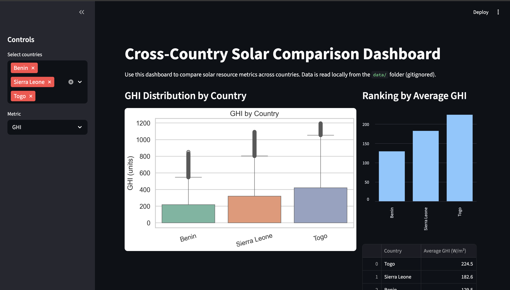

# Solar Challenge Week 1 - MoonLight Energy Solutions

## Project Overview
This repository contains a comprehensive analytics framework for MoonLight Energy Solutions' solar energy investment strategy. The project focuses on analyzing solar radiation measurement data from multiple regions to identify high-potential areas for solar installation that align with long-term sustainability goals.

## Business Objective
Develop a data-driven strategy to enhance operational efficiency and sustainability through targeted solar investments by analyzing environmental measurements and identifying key trends in solar radiation, temperature, humidity, and wind patterns.

## Repository Structure
```
├── .github/workflows/      # CI/CD pipeline configuration
├── src/                    # Modular source code
│   ├── data_loader.py     # Data loading utilities
│   ├── data_profiler.py   # Data profiling and quality analysis
│   ├── data_cleaner.py    # Data cleaning pipeline
│   ├── eda_analyzer.py    # Exploratory data analysis
│   └── visualization.py   # Visualization utilities
├── scripts/               # Executable scripts
│   ├── profile_data.py   # Data profiling script
│   └── clean_data.py     # Data cleaning script
├── notebooks/            # Jupyter notebooks for analysis
├── tests/               # Unit tests
├── reports/             # Generated analysis reports
├── data/               # Data files (gitignored)
└── requirements.txt    # Python dependencies
```

## Setup Instructions

### 1. Clone the Repository
```bash
git clone https://github.com/NaomiMeseret/solar-challenge-week1.git
cd solar-challenge-week1
```

### 2. Create Virtual Environment
```bash
python3 -m venv .venv
```

### 3. Activate Virtual Environment
```bash
source .venv/bin/activate   # macOS/Linux
.\.venv\Scripts\Activate    # Windows PowerShell
```

### 4. Install Dependencies
```bash
pip install -r requirements.txt
```

## Usage

### Data Profiling
Generate comprehensive data quality reports:
```bash
python scripts/profile_data.py benin
python scripts/profile_data.py togo
python scripts/profile_data.py sierra-leone
```

### Data Cleaning
Clean and prepare datasets for analysis:
```bash
python scripts/clean_data.py benin
python scripts/clean_data.py togo --keep-outliers
```

### Exploratory Data Analysis
Open and run the Jupyter notebooks in the `notebooks/` directory:
```bash
jupyter notebook notebooks/
```

## Key Features

### Modular Architecture
- **Data Loader**: Robust CSV loading with validation
- **Data Profiler**: Statistical summaries, missing value analysis, outlier detection
- **Data Cleaner**: Automated cleaning pipeline with logging
- **EDA Analyzer**: Time series analysis, correlation studies, pattern recognition
- **Visualizer**: Comprehensive plotting utilities

### Analysis Capabilities
- Summary statistics with advanced metrics (skewness, kurtosis)
- Missing value reporting with threshold alerts
- Outlier detection using Z-score and IQR methods
- Data quality scoring (completeness, validity, uniqueness)
- Time series pattern analysis (monthly, hourly)
- Correlation analysis and relationship mapping
- Cleaning impact assessment
- Wind and temperature-humidity analysis

### Automated CI/CD
- Automated testing with pytest
- Code linting with flake8
- Dependency validation
- Multi-branch support

## Data Dictionary

| Column | Description | Unit |
|--------|-------------|------|
| Timestamp | Date and time of observation | yyyy-mm-dd hh:mm |
| GHI | Global Horizontal Irradiance | W/m² |
| DNI | Direct Normal Irradiance | W/m² |
| DHI | Diffuse Horizontal Irradiance | W/m² |
| ModA | Module A sensor measurement | W/m² |
| ModB | Module B sensor measurement | W/m² |
| Tamb | Ambient Temperature | °C |
| RH | Relative Humidity | % |
| WS | Wind Speed | m/s |
| WSgust | Wind Gust Speed | m/s |
| WSstdev | Wind Speed Standard Deviation | m/s |
| WD | Wind Direction | °N (to east) |
| WDstdev | Wind Direction Standard Deviation | - |
| BP | Barometric Pressure | hPa |
| Cleaning | Cleaning event flag | 1 or 0 |
| Precipitation | Precipitation rate | mm/min |
| TModA | Module A Temperature | °C |
| TModB | Module B Temperature | °C |

## Contributing
1. Create a feature branch: `git checkout -b feature-name`
2. Make changes and commit: `git commit -m "description"`
3. Push to branch: `git push origin feature-name`
4. Create Pull Request

## Team
- **Analytics Engineer**: Naomi Meseret

## License
MoonLight Energy Solutions - Internal Use Only


## Interactive Dashboard (Streamlit)

This repository includes a simple Streamlit app to compare solar metrics across countries using local cleaned CSVs.

### Features
- Country multi-select (Benin, Sierra Leone, Togo)
- Metric selector (GHI, DNI, DHI)
- Boxplot by country
- Ranking bar chart by average GHI
- Summary table (mean / median / std)


### Run Locally
```bash
streamlit run app/main.py
```

Notes:
- The app reads local files from the `data/` folder (which is gitignored).
- Expected cleaned files: `benin_clean.csv`, `sierra_leone_clean.csv`, `togo_clean.csv`.
- Place the files in `data/` and run the app from the project root.
